# Polyglot Codebase Knowledge Graph

> Generated offline by **readmenator**. Supports C, C++, Python, Go, Rust, JS/TS, Java, C#, Shell, PHP, Dart, GDScript, Nim, ASM, Ruby, Swift, Kotlin, Scala, Lua, Elixir.
> No LLMs. No tokens. Pure static analysis. See more [here](https://github.com/grisuno/ReadMenator)

**Total Files Parsed:** 3 | **Total Symbols Extracted:** 30 | **Total Imports:** 15
 | **Resolved Imports:** 1

<!-- ranking_model: v1.0 | weights: {ppr:0.45,auth:0.2,test:0.15,doc:0.1,fresh:0.1} | alpha:0.85 | commit:4c8e0d2 | date:2026-07-18 -->


## Table of Contents

1. [Statistics Dashboard](#statistics-dashboard)
2. [Architectural Layers](#architectural-layers)
3. [Ranked Context](#ranked-context)
4. [God Nodes](#god-nodes)
5. [Community Analysis](#community-analysis)
6. [Suggested Questions](#suggested-questions)
7. [Hotspot Analysis](#hotspot-analysis)
8. [Change Impact Analysis](#change-impact-analysis)
9. [Suggested Linting Rules](#suggested-linting-rules)
10. [Orphans](#orphans)
11. [Query Recipes](#query-recipes)
12. [Structural Knowledge Map](#structural-knowledge-map)
13. [UML Class Diagram](#uml-class-diagram)
14. [Code Property Graph](#code-property-graph)
15. [Architecture Reference](#architecture-reference)
    - [PY (2 files)](#py-2-files)
    - [SH (1 files)](#sh-1-files)

---

## Statistics Dashboard

| Metric | Value |
|--------|-------|
| Total Files | 3 |
| Total Symbols | 30 |
| Total Imports | 15 |
| Call Edges | 182 |
| Inheritance Edges | 1 |
| Languages | 2 |
| Avg Symbols/File | 10.0 |
| Avg Imports/File | 5.0 |
| Resolved Imports | 1 |

### Top Files by Import Count (Fan-Out)

| File | Imports | Symbols | Language |
|------|---------|---------|----------|
| `neurothermo.py` | 12 | 30 | py |
| `app.py` | 3 | 0 | py |

---

## Architectural Layers

Auto-detected from path patterns, naming conventions, and imported frameworks.

| Layer | Files |
|-------|-------|
| utility | 3 |

### utility

- `app.py` (py, 0 symbols)
- `install.sh` (sh, 0 symbols)
- `neurothermo.py` (py, 30 symbols)

---

## Ranked Context

Files ranked by composite score for the current query context. The ranking combines Personalized PageRank (query relevance), global authority, test coverage, documentation coverage, and code freshness. Model: v1.0.

| Rank | File | Composite | PPR | Authority | Test | Doc |
|------|------|-----------|-----|-----------|------|-----|
| 1 | `neurothermo.py` | 0.4553 | 0.6491 | 0.6491 | 0.00 | 0.33 |
| 2 | `app.py` | 0.3281 | 0.3509 | 0.3509 | 0.00 | 1.00 |
| 3 | `install.sh` | 0.0000 | 0.0000 | 0.0000 | 0.00 | 0.00 |

---

## God Nodes

Most architecturally central files ranked by combined import/export degree and symbol richness.

| File | Score | Connections | PageRank |
|------|-------|-------------|----------|
| `neurothermo.py` | 5.0 | | 0.6491 |
| `app.py` | 2.0 | | 0.3509 |
| `install.sh` | 0.0 | | 0.0000 |

---

## Community Analysis

Files grouped by import-based community detection. Cohesion measures how tightly connected each community is internally.

### root (Cohesion: 1.00)

**2 files** in this community:

- `app.py` (py, 0 symbols)
- `neurothermo.py` (py, 30 symbols)

---

## Suggested Questions

Auto-generated exploration prompts based on graph structure:

- What does neurothermo.py depend on, and what depends on it? (1 connections)
- What does app.py depend on, and what depends on it? (1 connections)
- What does install.sh depend on, and what depends on it? (0 connections)
- What is PhaseState in neurothermo.py and how is it used?
- What is the overall architecture of this codebase?

---

## Hotspot Analysis

Files ranked by combined complexity (symbol count) and centrality (connection count). High-scoring files are architecturally critical and may need refactoring attention.

| File | Complexity | Centrality | Combined | Symbols | Connections |
|------|-----------|------------|----------|---------|-------------|
| `neurothermo.py` | 1.000 | 1.000 | 1.000 | 30 | 13 |
| `app.py` | 0.000 | 0.308 | 0.185 | 0 | 4 |
| `install.sh` | 0.000 | 0.000 | 0.000 | 0 | 0 |

---

## Change Impact Analysis

Files sorted by how many other files would be affected if they changed. High-impact files should be changed with caution.

| File | Direct Dependents | Transitive Dependents | Total Impact |
|------|------------------|----------------------|--------------|
| `neurothermo.py` | 1 | 0 | 1 |
| `app.py` | 0 | 0 | 0 |
| `install.sh` | 0 | 0 | 0 |

---

## Suggested Linting Rules

Automatically suggested linting and security rules based on patterns detected in the codebase. These can be exported as Semgrep rules using the `--export-rules` flag.

| Rule ID | Severity | Description | Language | Matches |
|---------|----------|-------------|----------|---------|
| `RM001` | info | Large number of functions in py: 23 total | py | 23 |
| `RM002` | info | Print statement found (consider logging instead) | python | 3 |

---

## Orphans

Files with no documentation or low connectivity. These are candidates for documentation investment or cleanup.

- `install.sh` (0 symbols, no doc)

---

## Query Recipes

Example queries you can run against this knowledge base using the ranking engine:

```
# Find files most relevant to a concept
readmenator query "Where is the import resolver implemented?"

# Rank files by relevance to a topic
readmenator query "How does documentation generation work?"

# Explain why a file ranks highly
readmenator query "explain readmenator/_documentation.py"

# Trace dependency paths with ranked context
readmenator query "path from CLI to exporter"
```

The ranking model uses the following signals:

- **Personalized PageRank** (45% weight): query-specific relevance via seed propagation
- **Global Authority** (20% weight): structural importance via standard PageRank
- **Test Coverage** (15% weight): fraction of symbols referenced in test files
- **Doc Coverage** (10% weight): presence of docstrings and file-level docs
- **Freshness** (10% weight): recent modification activity

Results include score decomposition and justification paths for each ranked item.

---

## Structural Knowledge Map

```mermaid
graph TD
    classDef mod fill:#1e1e1e,stroke:#ff6666,stroke-width:2px,color:#fff;
    classDef cls fill:#2d2d2d,stroke:#4ec9b0,stroke-width:2px,color:#fff;
    classDef fn fill:#333,stroke:#dcdcaa,stroke-width:1px,color:#dcdcaa;
    classDef ext fill:#111,stroke:#666,stroke-dasharray:5 5,color:#aaa;
    subgraph community_0 ["root"]
    neurothermo_py["neurothermo.py (py)"]
    class neurothermo_py mod;
    neurothermo_py_PhaseState["PhaseState"]
    class neurothermo_py_PhaseState cls;
    neurothermo_py --> neurothermo_py_PhaseState
    neurothermo_py_ThresholdConfig["ThresholdConfig"]
    class neurothermo_py_ThresholdConfig cls;
    neurothermo_py --> neurothermo_py_ThresholdConfig
    neurothermo_py_ComputeConfig["ComputeConfig"]
    class neurothermo_py_ComputeConfig cls;
    neurothermo_py --> neurothermo_py_ComputeConfig
    neurothermo_py_CoreConfig["CoreConfig"]
    class neurothermo_py_CoreConfig cls;
    neurothermo_py --> neurothermo_py_CoreConfig
    neurothermo_py_NeurothermoConfig["NeurothermoConfig"]
    class neurothermo_py_NeurothermoConfig cls;
    neurothermo_py --> neurothermo_py_NeurothermoConfig
    app_py["app.py (py)"]
    class app_py mod;
    install_sh["install.sh (sh)"]
    class install_sh mod;
    end
    app_py -- resolved_imports --> neurothermo_py
    ext_torch["torch"]
    class ext_torch ext;
    app_py -.->|imports| ext_torch
    ext_torch_nn["torch.nn"]
    class ext_torch_nn ext;
    app_py -.->|imports| ext_torch_nn
    ext_neurothermo["neurothermo"]
    class ext_neurothermo ext;
    app_py -.->|imports| ext_neurothermo
    ext___future__["__future__"]
    class ext___future__ ext;
    neurothermo_py -.->|imports| ext___future__
    ext_logging["logging"]
    class ext_logging ext;
    neurothermo_py -.->|imports| ext_logging
    ext_math["math"]
    class ext_math ext;
    neurothermo_py -.->|imports| ext_math
    ext_dataclasses["dataclasses"]
    class ext_dataclasses ext;
    neurothermo_py -.->|imports| ext_dataclasses
    ext_enum["enum"]
    class ext_enum ext;
    neurothermo_py -.->|imports| ext_enum
    ext_pathlib["pathlib"]
    class ext_pathlib ext;
    neurothermo_py -.->|imports| ext_pathlib
    ext_typing["typing"]
    class ext_typing ext;
    neurothermo_py -.->|imports| ext_typing
    ext_numpy["numpy"]
    class ext_numpy ext;
    neurothermo_py -.->|imports| ext_numpy
    ext_tomllib["tomllib"]
    class ext_tomllib ext;
    neurothermo_py -.->|imports| ext_tomllib
    neurothermo_py -.->|imports| ext_torch
    ext_torch_nn_utils["torch.nn.utils"]
    class ext_torch_nn_utils ext;
    neurothermo_py -.->|imports| ext_torch_nn_utils
    ext_tomli["tomli"]
    class ext_tomli ext;
    neurothermo_py -.->|imports| ext_tomli
```



---

## UML Class Diagram

Auto-generated Mermaid class diagram from parsed class-level symbols. Shows classes, structs, interfaces, traits, and their methods with inheritance and dependency relationships.

```mermaid
classDiagram
  class neurothermo_py_PhaseState {
    <<class>>
    +_detect_phase(delta)
    +create_monitor(model, window_size)
    +extract_weights(model)
    +extract_gradients(model)
    +from_toml(cls, path)
    +__init__(self, metrics, phase)
    +get(self, name, default)
    +to_dict(self)
    +phase(self)
    +__init__(self, model, config)
  }
  class neurothermo_py_ThresholdConfig {
    <<class>>
    +_detect_phase(delta)
    +create_monitor(model, window_size)
    +extract_weights(model)
    +extract_gradients(model)
    +from_toml(cls, path)
    +__init__(self, metrics, phase)
    +get(self, name, default)
    +to_dict(self)
    +phase(self)
    +__init__(self, model, config)
  }
  class neurothermo_py_ComputeConfig {
    <<class>>
    +_detect_phase(delta)
    +create_monitor(model, window_size)
    +extract_weights(model)
    +extract_gradients(model)
    +from_toml(cls, path)
    +__init__(self, metrics, phase)
    +get(self, name, default)
    +to_dict(self)
    +phase(self)
    +__init__(self, model, config)
  }
  class neurothermo_py_CoreConfig {
    <<class>>
    +_detect_phase(delta)
    +create_monitor(model, window_size)
    +extract_weights(model)
    +extract_gradients(model)
    +from_toml(cls, path)
    +__init__(self, metrics, phase)
    +get(self, name, default)
    +to_dict(self)
    +phase(self)
    +__init__(self, model, config)
  }
  class neurothermo_py_NeurothermoConfig {
    <<class>>
    +_detect_phase(delta)
    +create_monitor(model, window_size)
    +extract_weights(model)
    +extract_gradients(model)
    +from_toml(cls, path)
    +__init__(self, metrics, phase)
    +get(self, name, default)
    +to_dict(self)
    +phase(self)
    +__init__(self, model, config)
  }
  class neurothermo_py_MetricsResult {
    <<class>>
    +_detect_phase(delta)
    +create_monitor(model, window_size)
    +extract_weights(model)
    +extract_gradients(model)
    +from_toml(cls, path)
    +__init__(self, metrics, phase)
    +get(self, name, default)
    +to_dict(self)
    +phase(self)
    +__init__(self, model, config)
  }
  class neurothermo_py_ThermoMonitor {
    <<class>>
    +_detect_phase(delta)
    +create_monitor(model, window_size)
    +extract_weights(model)
    +extract_gradients(model)
    +from_toml(cls, path)
    +__init__(self, metrics, phase)
    +get(self, name, default)
    +to_dict(self)
    +phase(self)
    +__init__(self, model, config)
  }
```



---

## Code Property Graph

Machine-readable Code Property Graph (CPG) in JSON-LD format. This block allows AI agents to parse the full structural graph without additional file reads. Compatible with GraphRAG pipelines.

```json
{"@context": "https://schema.org", "analysis": {"communities": [{"cohesion": 1.0, "id": 0, "label": "root", "size": 2}], "god_nodes": [{"node_id": "neurothermo.py", "score": 5.0}, {"node_id": "app.py", "score": 2.0}, {"node_id": "install.sh", "score": 0.0}], "surprising_connections": []}, "edges": [{"confidence": "EXTRACTED", "relation": "imports", "source": "app.py", "target": "torch"}, {"confidence": "EXTRACTED", "relation": "imports", "source": "app.py", "target": "torch.nn"}, {"confidence": "EXTRACTED", "relation": "imports", "source": "app.py", "target": "neurothermo"}, {"confidence": "EXTRACTED", "relation": "imports", "source": "neurothermo.py", "target": "__future__"}, {"confidence": "EXTRACTED", "relation": "imports", "source": "neurothermo.py", "target": "logging"}, {"confidence": "EXTRACTED", "relation": "imports", "source": "neurothermo.py", "target": "math"}, {"confidence": "EXTRACTED", "relation": "imports", "source": "neurothermo.py", "target": "dataclasses"}, {"confidence": "EXTRACTED", "relation": "imports", "source": "neurothermo.py", "target": "enum"}, {"confidence": "EXTRACTED", "relation": "imports", "source": "neurothermo.py", "target": "pathlib"}, {"confidence": "EXTRACTED", "relation": "imports", "source": "neurothermo.py", "target": "typing"}, {"confidence": "EXTRACTED", "relation": "imports", "source": "neurothermo.py", "target": "numpy"}, {"confidence": "EXTRACTED", "relation": "imports", "source": "neurothermo.py", "target": "tomllib"}, {"confidence": "EXTRACTED", "relation": "imports", "source": "neurothermo.py", "target": "torch"}, {"confidence": "EXTRACTED", "relation": "imports", "source": "neurothermo.py", "target": "torch.nn.utils"}, {"confidence": "EXTRACTED", "relation": "imports", "source": "neurothermo.py", "target": "tomli"}, {"confidence": "EXTRACTED", "relation": "resolved_imports", "source": "app.py", "target": "neurothermo.py"}], "generator": "readmenator", "metadata": {"edge_count": 199, "file_count": 3, "language_count": 2, "symbol_count": 30}, "nodes": [{"doc": "_*_ coding: utf8 _*_", "id": "app.py", "kind": "module", "label": "app.py", "language": "py", "sha256": "57b21bdb023585b8", "symbol_count": 0, "symbols": []}, {"id": "install.sh", "kind": "module", "label": "install.sh", "language": "sh", "sha256": "c907d80fd6734993", "symbol_count": 0, "symbols": []}, {"id": "neurothermo.py", "kind": "module", "label": "neurothermo.py", "language": "py", "sha256": "1d37d9b26a622cb3", "symbol_count": 30, "symbols": [{"doc": "Thermodynamic phase states.", "kind": "class", "line": 32, "name": "PhaseState", "signature": "class PhaseState(Enum)"}, {"kind": "class", "line": 43, "name": "ThresholdConfig", "signature": "class ThresholdConfig"}, {"kind": "class", "line": 53, "name": "ComputeConfig", "signature": "class ComputeConfig"}, {"kind": "class", "line": 58, "name": "CoreConfig", "signature": "class CoreConfig"}, {"kind": "class", "line": 65, "name": "NeurothermoConfig", "signature": "class NeurothermoConfig"}, {"doc": "Container for step metrics (only delta/alpha/health/phase during training).", "kind": "class", "line": 84, "name": "MetricsResult", "signature": "class MetricsResult"}, {"doc": "Fast phase detection from delta only.", "kind": "method", "line": 102, "name": "_detect_phase", "signature": "def _detect_phase(delta)"}, {"doc": "Monitoring class.\n\nDuring training: ONLY delta (O(n), instant)\nAt summary(): ALL 17 metrics from accumulated history", "kind": "class", "line": 111, "name": "ThermoMonitor", "signature": "class ThermoMonitor"}, {"doc": "Create monitor. During training only delta is computed (fast).", "kind": "method", "line": 389, "name": "create_monitor", "signature": "def create_monitor(model, window_size)"}, {"kind": "method", "line": 398, "name": "extract_weights", "signature": "def extract_weights(model)"}, {"kind": "method", "line": 404, "name": "extract_gradients", "signature": "def extract_gradients(model)"}, {"kind": "method", "line": 71, "name": "from_toml", "signature": "def from_toml(cls, path)"}, {"kind": "method", "line": 87, "name": "__init__", "signature": "def __init__(self, metrics, phase)"}, {"kind": "method", "line": 91, "name": "get", "signature": "def get(self, name, default)"}, {"kind": "method", "line": 94, "name": "to_dict", "signature": "def to_dict(self)"}, {"kind": "method", "line": 98, "name": "phase", "signature": "def phase(self)"}, {"kind": "method", "line": 118, "name": "__init__", "signature": "def __init__(self, model, config)"}, {"kind": "method", "line": 135, "name": "_setup_logger", "signature": "def _setup_logger(self)"}, {"kind": "method", "line": 144, "name": "_extract_weights", "signature": "def _extract_weights(self)"}, {"kind": "method", "line": 151, "name": "_extract_gradients", "signature": "def _extract_gradients(self)"}, {"doc": "Fast step: ONLY computes delta. Stores data for final metrics.", "kind": "method", "line": 157, "name": "step", "signature": "def step(self, loss)"}, {"doc": "Manual step with provided arrays.", "kind": "method", "line": 163, "name": "step_manual", "signature": "def step_manual(self, weights, gradients, loss)"}, {"doc": "Compute ONLY delta. Everything else deferred to summary().", "kind": "method", "line": 172, "name": "_do_step", "signature": "def _do_step(self, weights, gradients, loss)"}, {"kind": "method", "line": 208, "name": "epoch_end", "signature": "def epoch_end(self)"}, {"kind": "method", "line": 211, "name": "get_phase_description", "signature": "def get_phase_description(self, phase)"}, {"kind": "method", "line": 222, "name": "reset", "signature": "def reset(self)"}, {"doc": "Compute ALL 17 metrics from history. Call after training.", "kind": "method", "line": 232, "name": "compute_all_metrics", "signature": "def compute_all_metrics(self)"}, {"doc": "Generate summary with ALL metrics.", "kind": "method", "line": 329, "name": "summary", "signature": "def summary(self)"}, {"kind": "method", "line": 381, "name": "step_count", "signature": "def step_count(self)"}, {"kind": "method", "line": 385, "name": "last_result", "signature": "def last_result(self)"}]}], "type": "CodePropertyGraph", "version": "1.0"}
```

---

## Architecture Reference

### PY (2 files)

#### `app.py`
**Path:** `app.py`
**File Doc:** *_*_ coding: utf8 _*_*

*No symbols extracted*

#### `neurothermo.py`
**Path:** `neurothermo.py`

**Classes:**
- `PhaseState` (line 32) `class PhaseState(Enum)` - *Thermodynamic phase states.*
- `ThresholdConfig` (line 43) `class ThresholdConfig`
- `ComputeConfig` (line 53) `class ComputeConfig`
- `CoreConfig` (line 58) `class CoreConfig`
- `NeurothermoConfig` (line 65) `class NeurothermoConfig`
- `MetricsResult` (line 84) `class MetricsResult` - *Container for step metrics (only delta/alpha/health/phase during training).*
- `ThermoMonitor` (line 111) `class ThermoMonitor` - *Monitoring class.

During training: ONLY delta (O(n), instant)
At summary(): ALL 17 metrics from accumulated history*

**Methods:**
- `_detect_phase` (line 102) `def _detect_phase(delta)` - *Fast phase detection from delta only.*
- `create_monitor` (line 389) `def create_monitor(model, window_size)` - *Create monitor. During training only delta is computed (fast).*
- `extract_weights` (line 398) `def extract_weights(model)`
- `extract_gradients` (line 404) `def extract_gradients(model)`
- `from_toml` (line 71) `def from_toml(cls, path)`
- `__init__` (line 87) `def __init__(self, metrics, phase)`
- `get` (line 91) `def get(self, name, default)`
- `to_dict` (line 94) `def to_dict(self)`
- `phase` (line 98) `def phase(self)`
- `__init__` (line 118) `def __init__(self, model, config)`
- `_setup_logger` (line 135) `def _setup_logger(self)`
- `_extract_weights` (line 144) `def _extract_weights(self)`
- `_extract_gradients` (line 151) `def _extract_gradients(self)`
- `step` (line 157) `def step(self, loss)` - *Fast step: ONLY computes delta. Stores data for final metrics.*
- `step_manual` (line 163) `def step_manual(self, weights, gradients, loss)` - *Manual step with provided arrays.*
- `_do_step` (line 172) `def _do_step(self, weights, gradients, loss)` - *Compute ONLY delta. Everything else deferred to summary().*
- `epoch_end` (line 208) `def epoch_end(self)`
- `get_phase_description` (line 211) `def get_phase_description(self, phase)`
- `reset` (line 222) `def reset(self)`
- `compute_all_metrics` (line 232) `def compute_all_metrics(self)` - *Compute ALL 17 metrics from history. Call after training.*
- `summary` (line 329) `def summary(self)` - *Generate summary with ALL metrics.*
- `step_count` (line 381) `def step_count(self)`
- `last_result` (line 385) `def last_result(self)`

### SH (1 files)

#### `install.sh`
**Path:** `install.sh`

*No symbols extracted*
