# Polyglot Codebase Knowledge Graph

> Generated offline by **readmenator**. Supports C, C++, Python, Go, Rust, JS/TS, Java, C#, Shell, PHP, Dart, GDScript, Nim, ASM.
> No LLMs. No tokens. Pure static analysis. See more [here](https://github.com/grisuno/ReadMenator)

**Total Files Parsed:** 3 | **Total Symbols Extracted:** 30 | **Total Imports:** 15

## Structural Knowledge Map

```mermaid
graph TD
    classDef mod fill:#1e1e1e,stroke:#ff6666,stroke-width:2px,color:#fff;
    classDef cls fill:#2d2d2d,stroke:#4ec9b0,stroke-width:2px,color:#fff;
    classDef fn fill:#333,stroke:#dcdcaa,stroke-width:1px,color:#dcdcaa;
    classDef ext fill:#111,stroke:#666,stroke-dasharray:5 5,color:#aaa;
    neurothermo_py["neurothermo.py (py)"]
    class neurothermo_py mod;
    neurothermo_py_PhaseState["PhaseState"]
    class neurothermo_py_PhaseState cls;
    neurothermo_py --> neurothermo_py_PhaseState
    neurothermo_py_ThresholdConfig["ThresholdConfig"]
    class neurothermo_py_ThresholdConfig cls;
    neurothermo_py --> neurothermo_py_ThresholdConfig
    neurothermo_py_ComputeConfig["ComputeConfig"]
    class neurothermo_py_ComputeConfig cls;
    neurothermo_py --> neurothermo_py_ComputeConfig
    neurothermo_py_CoreConfig["CoreConfig"]
    class neurothermo_py_CoreConfig cls;
    neurothermo_py --> neurothermo_py_CoreConfig
    neurothermo_py_NeurothermoConfig["NeurothermoConfig"]
    class neurothermo_py_NeurothermoConfig cls;
    neurothermo_py --> neurothermo_py_NeurothermoConfig
    app_py["app.py (py)"]
    class app_py mod;
    install_sh["install.sh (sh)"]
    class install_sh mod;
    ext_torch["torch"]
    class ext_torch ext;
    app_py -.->|imports| ext_torch
    ext_torch_nn["torch.nn"]
    class ext_torch_nn ext;
    app_py -.->|imports| ext_torch_nn
    ext_neurothermo["neurothermo"]
    class ext_neurothermo ext;
    app_py -.->|imports| ext_neurothermo
    ext___future__["__future__"]
    class ext___future__ ext;
    neurothermo_py -.->|imports| ext___future__
    ext_logging["logging"]
    class ext_logging ext;
    neurothermo_py -.->|imports| ext_logging
    ext_math["math"]
    class ext_math ext;
    neurothermo_py -.->|imports| ext_math
    ext_dataclasses["dataclasses"]
    class ext_dataclasses ext;
    neurothermo_py -.->|imports| ext_dataclasses
    ext_enum["enum"]
    class ext_enum ext;
    neurothermo_py -.->|imports| ext_enum
    ext_pathlib["pathlib"]
    class ext_pathlib ext;
    neurothermo_py -.->|imports| ext_pathlib
    ext_typing["typing"]
    class ext_typing ext;
    neurothermo_py -.->|imports| ext_typing
    ext_numpy["numpy"]
    class ext_numpy ext;
    neurothermo_py -.->|imports| ext_numpy
    ext_tomllib["tomllib"]
    class ext_tomllib ext;
    neurothermo_py -.->|imports| ext_tomllib
    neurothermo_py -.->|imports| ext_torch
    ext_torch_nn_utils["torch.nn.utils"]
    class ext_torch_nn_utils ext;
    neurothermo_py -.->|imports| ext_torch_nn_utils
    ext_tomli["tomli"]
    class ext_tomli ext;
    neurothermo_py -.->|imports| ext_tomli
```

---

## Architecture Reference

### PY (2 files)

#### `app.py`
**Path:** `app.py`

*No symbols extracted*

#### `neurothermo.py`
**Path:** `neurothermo.py`

**Classes:**
- `PhaseState` (line 32) `class PhaseState(Enum)` - *Thermodynamic phase states.*
- `ThresholdConfig` (line 43) `class ThresholdConfig`
- `ComputeConfig` (line 53) `class ComputeConfig`
- `CoreConfig` (line 58) `class CoreConfig`
- `NeurothermoConfig` (line 65) `class NeurothermoConfig`
- `MetricsResult` (line 84) `class MetricsResult` - *Container for step metrics (only delta/alpha/health/phase during training).*
- `ThermoMonitor` (line 111) `class ThermoMonitor` - *Monitoring class.

During training: ONLY delta (O(n), instant)
At summary(): ALL 17 metrics from accumulated history*

**Functions:**
- `_detect_phase` (line 102) `def _detect_phase(delta)` - *Fast phase detection from delta only.*
- `create_monitor` (line 389) `def create_monitor(model, window_size)` - *Create monitor. During training only delta is computed (fast).*
- `extract_weights` (line 398) `def extract_weights(model)`
- `extract_gradients` (line 404) `def extract_gradients(model)`
- `from_toml` (line 71) `def from_toml(cls, path)`
- `__init__` (line 87) `def __init__(self, metrics, phase)`
- `get` (line 91) `def get(self, name, default)`
- `to_dict` (line 94) `def to_dict(self)`
- `phase` (line 98) `def phase(self)`
- `__init__` (line 118) `def __init__(self, model, config)`
- `_setup_logger` (line 135) `def _setup_logger(self)`
- `_extract_weights` (line 144) `def _extract_weights(self)`
- `_extract_gradients` (line 151) `def _extract_gradients(self)`
- `step` (line 157) `def step(self, loss)` - *Fast step: ONLY computes delta. Stores data for final metrics.*
- `step_manual` (line 163) `def step_manual(self, weights, gradients, loss)` - *Manual step with provided arrays.*
- `_do_step` (line 172) `def _do_step(self, weights, gradients, loss)` - *Compute ONLY delta. Everything else deferred to summary().*
- `epoch_end` (line 208) `def epoch_end(self)`
- `get_phase_description` (line 211) `def get_phase_description(self, phase)`
- `reset` (line 222) `def reset(self)`
- `compute_all_metrics` (line 232) `def compute_all_metrics(self)` - *Compute ALL 17 metrics from history. Call after training.*
- `summary` (line 329) `def summary(self)` - *Generate summary with ALL metrics.*
- `step_count` (line 381) `def step_count(self)`
- `last_result` (line 385) `def last_result(self)`

### SH (1 files)

#### `install.sh`
**Path:** `install.sh`

*No symbols extracted*
